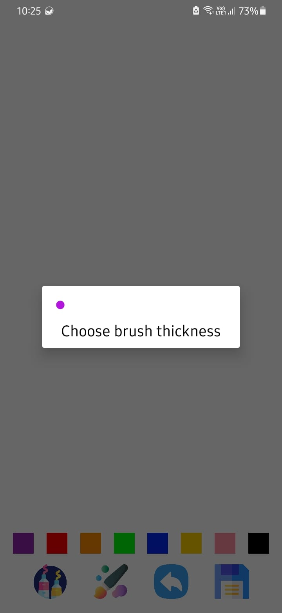
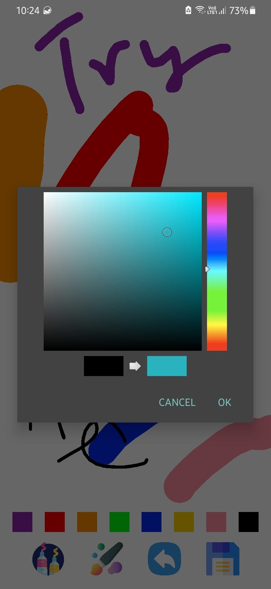
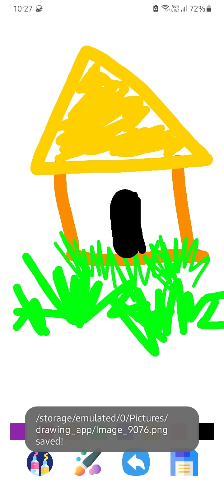

# 🖌️ Drawing App - Android

A simple and intuitive drawing application built in Kotlin for Android devices. Users can freely draw on a canvas, pick brush colors and sizes, and save their creations directly to the device’s gallery in a dedicated album named `drawing_app`.

---

## ✨ Features

- 🎨 Interactive drawing canvas with touch gestures  
- 🖍️ Selectable brush colors and sizes  
- 💾 Save drawings as PNG files  
- 🗂️ Drawings saved in `Pictures/drawing_app` and visible in Gallery  
- 📂 Media scanner integration for instant visibility

---

## 🛠️ Tech Stack

- **Language:** Kotlin  
- **Platform:** Android  
- **Storage:** File system + `MediaScannerConnection`  
- **Minimum SDK:** 29  

---

## 📸 Screenshots

  
  
  

---

## 🚀 Getting Started

### Prerequisites
- Android device or emulator
- Kotlin enabled

### Download APK
<a href="https://i.loadly.io/r1Gd1Bwn"> <i>Click here to download from Loadly.io</i></a>

